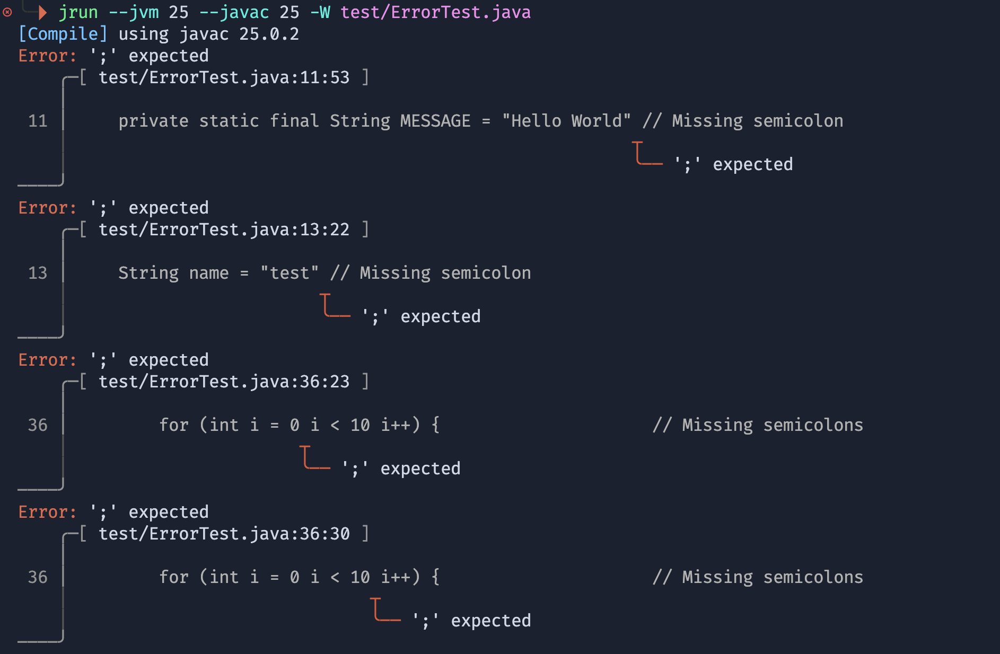
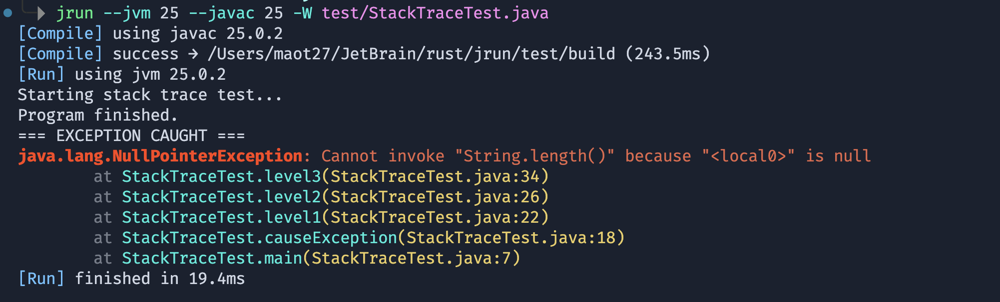

# jrun

A fast CLI tool that compiles and runs a Java source file in one command. Aimed at quick iteration on single-file Java — handy for competitive programming, testing algorithm ideas, or running throwaway scripts without setting up a full project.

It discovers all `java`/`javac` installations on your system and lets you target a specific version without touching environment variables. Compile errors are rendered with source snippets and span highlighting (via [ariadne](https://github.com/zesterer/ariadne)), and runtime exceptions are colorized for quick scanning.

## Screen Shot





## Install

```bash
cargo install --path .
```

## Usage

```bash
# Compile and run a file with the default toolchain
$ jrun Main.java

# Use a specific Java version (prefix match: "21" matches "21.0.2")
$ jrun --javac 21 Main.java

# Use different versions for compiler and runtime
$ jrun --javac 21 --jvm 17 Main.java

# Use an exact path
$ jrun --javac /opt/homebrew/opt/openjdk@21/bin/javac Main.java

# Override the output directory for .class files (default: ./build)
$ jrun --output /tmp/classes Main.java

# Enable all warnings and treat them as errors (-Xlint:all -Werror)
$ jrun -W Main.java

# List all detected installations
$ jrun --list

# Save a toolchain selection as the new default
$ jrun --javac 21 --set-default
```

## Examples

**Successful run with runtime exception:**

```bash
$ jrun --javac 25 --jvm 25 -W test/StackTraceTest.java
[Compile] using javac 25.0.2
[Compile] success → test/build (247.3ms)
[Run] using jvm 25.0.2
Starting stack trace test...
Program finished.
=== EXCEPTION CAUGHT ===
java.lang.NullPointerException: Cannot invoke "String.length()" because "<local0>" is null
    at StackTraceTest.level3(StackTraceTest.java:34)
    at StackTraceTest.level2(StackTraceTest.java:26)
    at StackTraceTest.level1(StackTraceTest.java:22)
    at StackTraceTest.causeException(StackTraceTest.java:18)
    at StackTraceTest.main(StackTraceTest.java:7)
[Run] finished in 18.5ms
```

**Compile error with source diagnostics:**

```bash
$ jrun --javac 25 --jvm 25 -W test/ErrorTest.java
[Compile] using javac 25.0.2
Error: ';' expected
    ╭─[ test/ErrorTest.java:11:53 ]
    │
 11 │     private static final String MESSAGE = "Hello World" // Missing semicolon
    │                                                        ┬
    │                                                        ╰── ';' expected
────╯
Error: ';' expected
    ╭─[ test/ErrorTest.java:13:22 ]
    │
 13 │     String name = "test" // Missing semicolon
    │                         ┬
    │                         ╰── ';' expected
────╯
error: aborting due to 2 previous errors

```

## How it works

On first run, jrun detects the default `java` and `javac` from `$PATH` and writes them to a config file at `~/.config/jrun/config.json`. Subsequent runs read that config so version discovery is skipped unless `--javac` or `--jvm` is passed.

When a version flag is given, jrun scans every `java`/`javac` on `$PATH` and matches by:

1. Exact path (e.g. `/usr/bin/javac`)
2. Exact version string (e.g. `21.0.2`)
3. Version prefix (e.g. `21` matches `21.0.2`)

After a successful compile, the class is run immediately using the resolved JVM. The class name is inferred from the source filename, so the filename must match the public class name (standard Java requirement).

If the selected `javac` version is higher than the selected JVM version, jrun warns upfront to avoid a surprise `UnsupportedClassVersionError` at runtime.

## Config files

| File                          | Purpose                                     |
| ----------------------------- | ------------------------------------------- |
| `~/.config/jrun/setting.json` | Points to the config file location          |
| `~/.config/jrun/config.json`  | Stores the default `java` and `javac` paths |

To reset to PATH defaults, delete `config.json` and run any `jrun` command.

## Environment

Set `RUST_LOG=debug` (or `info`, `warn`) to enable log output. jrun loads `.env` from the working directory automatically if present.
